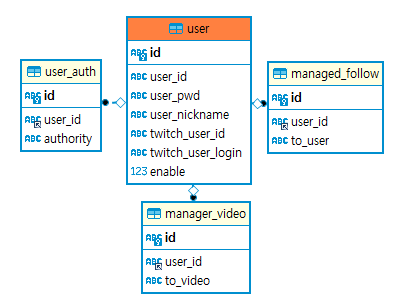

2021.11.04 프로젝트 재개
====================
전체 프로젝트 정리 및 DB 재정비
---------------
프로젝트를 재시작하면서, 지금까지 부족했던 DB를 수정하고, 코드문을 좀더 다듬는 작업을 진행할 예정입니다.

## DB 재정비      
DB는 우선 PRIMARY KEY가 제대로 존재하지 않아서, 쿼리문에서 좋지않은 성능을 보이던 부분을 개선하고, 기존에 트위치 데이터를 모두 트위치 API를 통해서만 가져왔기 때문에, 지나치게 오래걸리는 연산을, 별도의 테이블을 준비하여 스트리머의 데이터를 지속적으로 저장함으로써, 캐싱하여 연산속도를 올릴 계획입니다.              

           
새롭게 계획한 DB 테이블의 기본 구조는 위와 같습니다.
기존에는 user_auth, managed_follow, managed_video 테이블에 id값이 부재하여, 쿼리할때에 여러개의 조건문을 걸어야했지만, UUID를 이용한 id값을 모두 부여하여 의미없는 기본키값을 생성하였습니다.       

## 앞으로 할 작업
프로젝트를 재정비하면서 진행하게 될 작업은 다음과 같습니다.
* DB 변화에 따라 Mapper, Service, Controller의 구조를 변경
* 전체위치 공통의 javascript 코드를 구성하여 중복되는 코드를 줄임
* Ajax 통신하는 별도의 메소드 생성(위의 일환)
* 로그인 관련 재정비(회원가입, 로그인, 권한관리 등 Spring Secutiry 관련)
* 팔로우 채널 관리 재정비 (팔로우한 채널의 데이터를 지속적으로 DB에 추가)
* 다시보기 찜 관리 재정비 (다시보기 찜 정보를 테이블에 좀 더 상세하게 기록)
* 검색기능 재정비 (검색속도 개선, DB에 관련 데이터를 추가하여, 트위치 API와의 통신을 최소화)
* 전체적인 페이지의 디자인 변경