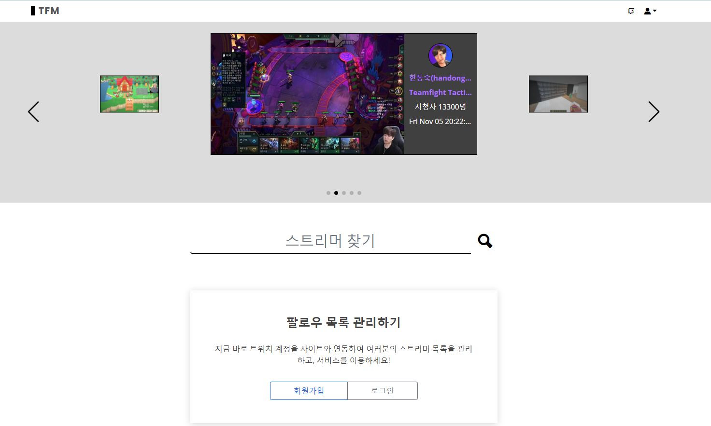
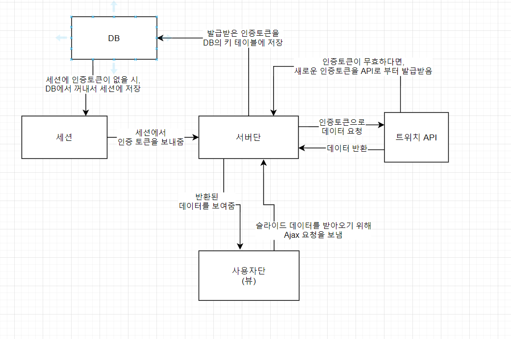

2021.11.05 헤더슬라이드 복구 및 새로운 원칙 정의
====================
## 헤더 슬라이더 복구

메인 페이지의 헤더 슬라이더가 정상적으로 동작하도록 복구하였으며, 해당하는 부분의 코드를 수정하였습니다.
헤더 슬라이더의 데이터를 가져오는 구조는 다음과 같이 변경하였습니다.            

1. 사용자 페이지에서 서버에 Ajax통신으로 데이터 요청을 보냅니다.         
2. 서버에서는 세션에 저장되어있는 인증 토큰을 확인합니다.         
2-1. 세션에 인증토큰이 없다면, DB에서 꺼내서 세션에 저장해줍니다.        
3. 인증토큰을 이용하여 API와 통신을 통해서 라이브 스트리머에 대한 데이터값을 반환받습니다.            
3-1. 인증토큰이 무효하다면, API로부터 새로운 인증토큰을 발급받습니다.     
3-2. 발급받은 인증토큰을 DB에 저장합니다.     
3-3. DB에 저장한 인증토큰을 다시 세션에 저장하고, 해당 값으로 다시 요청을 보내어 데이터값을 반환받습니다.      
4. 반환된 데이터값을 Ajax의 결과값으로 돌려줍니다.      

위와 같은 방식을 통해서, 얻을 수 있는 장점은 다음과 같습니다.
* 사용자가 요청할 때마다 API에서 매 번 새로운 인증토큰을 받아올 필요가 없습니다.       
DB에 인증토큰을 유지하고, 이를 다시 세션에 캐싱하는 방식이므로, 세션이 유지되는 한, 해당 인증토큰을 계속해서 이용하면 됩니다.

* 인증토큰의 유효시간이 끝나더라도 별도의 처리가 필요없으며, 오류없이 계속해서 정상적인 페이지를 보여줄 수 있습니다.      
인증 토큰에는 유효기간이 있으며, 끝나면 API에서 새로운 값을 받아와야합니다. 이 과정을 자동화하여, 특별한 조작없이 데이터 통신이 가능합니다.       
      
   
* 슬라이더 데이터를 뷰에서 Ajax로 통신하기 때문에, 메인페이지 자체 로딩이 짧습니다.        
컨트롤러 동작에서 많은 시간이 걸리지 않기 때문에 페이지 이동은 빠르고, 해당하는 데이터의 로딩시간이 걸리게 됩니다.     
이는 사용자의 입장에서, 현재 처리되고 있는 상황을 실시간으로 보여줌으로써, 사이트를 이용하는 편의성에 도움이 됩니다.      
       
        
## 원칙정의
앞으로 프로젝트를 진행하는데 있어서 필요한 원칙을 몇가지 지정합니다.
1. 무조건 스크립트에서는 document.ready를 사용하여 사용자 콘솔단에 변수가 누락되는 부분을 최소화시킨다.
2. 스크립트의 공통적으로 중복되는 함수들은 별도의 js파일로 모아두어서 모듈과같이 떼서 사용할 수 있도록 구성한다.
3. 절대 서버의 비밀값인 clientId, clientSecret은 사용자단에 공개되지 않는다. (이외에도 인증토큰 등은 공개되어서는 안됨.)
4. DB에 영향이 가는 Insert, Update, Delete문이 들어가는 Url은 무조건적으로 인증을 통해서 진행하도록 한다. (최소 자동입력 방지가 포함되어야함.)

