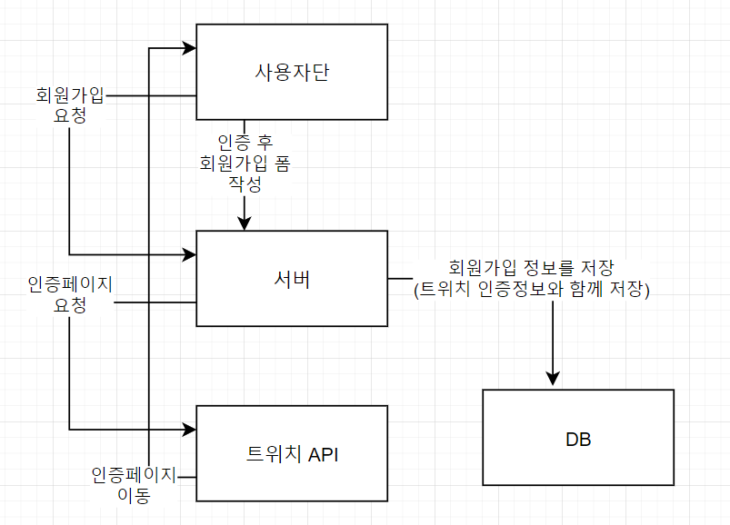
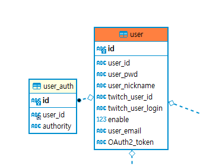
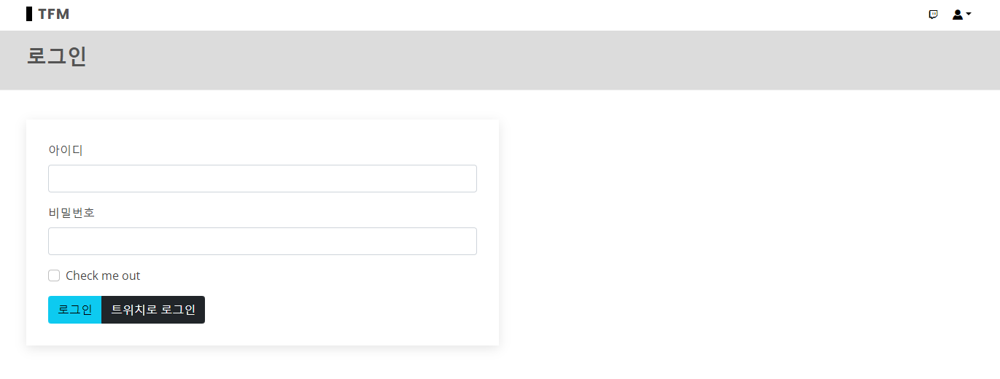

2021.11.06 로그인/회원가입 처리 복구 및 DB수정
====================
## 회원가입 (트위치 데이터를 이용)
TFM의 회원가입은 반드시 트위치 계정과 연동되어야 사용이 가능합니다.      
트위치 계정의 현재 팔로우목록 데이터를 가져와서, 해당 값을 이용한 서비스를 제공하기 때문입니다.     
회원가입 처리 절차는 다음과 같습니다.     
      
1. 사용자단에서 서버로 회원가입 버튼을 클릭하면 회원가입 요청을 보낸다.
2. 서버는 트위치 API로 인증페이지를 요청하고, 트위치 API에서 인증을 위한 페이지를 사용자에게 보낸다.
3. 인증을 마친 사용자는, 인증페이지 요청에 들어있던 파라미터값으로, 자동으로 회원가입 폼으로 이동한다.
4. 사용자가 회원가입 폼을 작성하여 서버로 회원가입 요청을 보낸다.
5. 서버에서는 DB로 트위치 인증정보와 함께, 사용자 정보를 저장하여 회원가입이 완료된다.       

            
사용자 DB구조입니다.      
사용자 폼 작성값, 트위치 계정정보, 그리고 실시간 인증토큰을 함께 저장하여, 인증이 필요할 때마다 API에 지속적으로 요청을 보내지 않도록 합니다.     
인증이 무효되었을 경우에는, 서버단 처리와 마찬가지로 자동으로 초기화되도록 합니다. 이와 관련한 부분은 [서버에서 트위치 API와 통신하여 데이터를 가져오는 구조](20211106.md)를 참고해주세요.      
사용자가 가입한 경우에, 사용자 권한 테이블인 user_auth에는 자동으로 일반 사용자 권한이 저장됩니다.       
관리자 권한에 따른 별도의 처리는 현재 사이트에서는 구성하지 않았습니다.

## 로그인 처리    
        
현 페이지에 로그인은 다음 두가지 방식을 지원합니다.     

### 아이디와 비밀번호를 입력하여 DB에 저장된 값으로 로그인
일반적인 스프링 시큐리티를 이용한 로그인 방식입니다. 커스텀으로 스프링 시큐리티를 구현하였습니다.      
````
@Override
public Authentication authenticate(Authentication authentication) throws AuthenticationException {
        ...
        // 일반 로그인 처리
        UserDTO user = (UserDTO) service.loadUserByUsername(user_id);
        if(user == null) throw new UsernameNotFoundException(user_id);
        if(!passwordEncoder.matches(user_pwd, user.getPassword())) throw new BadCredentialsException(user_id);
        if(!user.isEnabled()) throw new DisabledException(user_id);
        user.setUser_pwd("");	// 비밀번호는 객체에 적용하지 않음
        
        Object returnUser = user;
        authToken = new UsernamePasswordAuthenticationToken(returnUser, user_pwd, user.getAuthorities());   
    }
    return authToken;
}
````
1. UserDeatailService에서 아이디와 일치하는 계정을 DB에서 가져옵니다.     
1-1. 일치하는 데이터가 없으면 UsernameNotFoundException를 발생시킵니다.  
2. 비밀번호가 일치하는지 검증을 합니다.    
2-1. 비밀번호가 일치하지 않으면, BadCredentialsException를 발생시킵니다.    
2-2. 비밀번호는 일치하지만, 사용불가능한 계정이라면(isEnabled가 false라면) DisabledException를 발생시킵니다.   
3. 세션상에 로그인 객체를 저장할 때, 비밀번호값은 저장하지 않도록 합니다.
4. UsernamePasswordAuthenticationToken 로 인증된 계정 객체와, 권한을 세션에 저장하여 반환합니다.        


### 트위치 OAuth2 토큰을 인증하면 자동으로 DB 저장된 값으로 로그인
트위치로 로그인 버튼을 클릭하면, 먼저 회원가입 절차와 동일하게, 인증페이지로 보내서, 인증 토큰을 받아오게 합니다.     
그리고 로그인 요청시에, 자동으로 Id와 패스워드값을 세팅하여 요청을 보내도록 합니다.    
여기서 Id는 요청을 위한 고정값, 그리고 비밀번호로는 인증코드가 자동으로 세팅됩니다.       
````
@Override
public Authentication authenticate(Authentication authentication) throws AuthenticationException {
        ...
			// 들어온 토큰으로 API처리를 이용해서 사용자 정보를 가져와서, 이를 이용해서 Service에서 값을 가져옴
            String client_id = new Key().getClientId();
            TwitchUser tuser = streamGenerator.getUser(client_id, user_pwd, "");
            UserDTO user = (UserDTO) service.loadUserByTwitchUsername(tuser.getId());
            user.setUser_pwd("");	// 비밀번호는 객체에 적용하지 않음
            user.setOauth_token(user_pwd);
            
            Object returnUser = user;
            authToken = new UsernamePasswordAuthenticationToken(returnUser, user_pwd, user.getAuthorities());
    }
    return authToken;
}
````
1. 클라이언트 id값을 꺼내어, 트위치 API에 요청을 보내서 인증코드에 해당하는 계정정보를 받아옵니다.
2. 계정정보와 일치하는 db상의 계정을 받아옵니다. (현재 계정이 존재하지 않을시에 별도의 오류처리가 되어있지 않습니다.)
3. UsernamePasswordAuthenticationToken로 인증된 계정 객체와, 인증 권한을 세션에 저장하여 반환합니다.      

본래 시큐리티가 지원하는 기본 로그인 기능을 사용하려고 했으나,     
OAuth2토큰을 사용한 로그인을 구현해보고 싶어서 커스텀으로 스프링 시큐리티 로그인을 직접 구현해보았습니다.    
위 커스텀 인증Provider뿐 아니라, 커스텀 UserDetailService와 OAuth2토큰 저장을 위한 커스텀 UserDTO 객체도 별도로 구현해놓은 상태입니다.    

## 다음 목표
* 사용자 로그인에 따라서 팔로우 데이터를 가져와서 DB 캐시값으로 저장하기
* OAuth토큰을 DB상에 지속적으로 갱신하여 저장할 수 있는 방안 마련하기
* 토큰 사용에 따라서 서비스 지원을 위한 데이터를 가져올 수 있는 방안 마련하기


