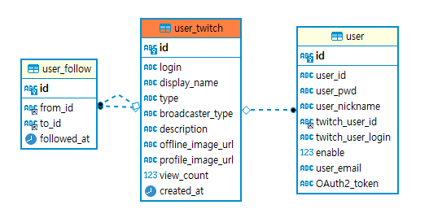
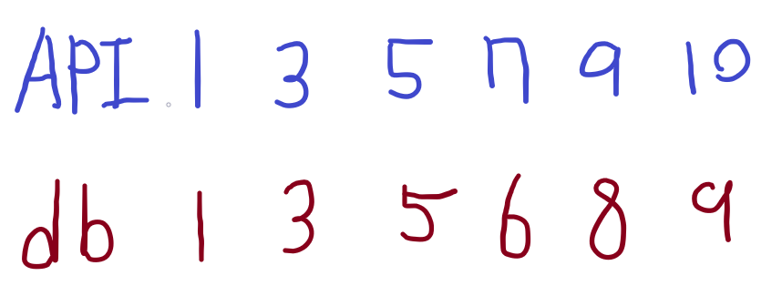
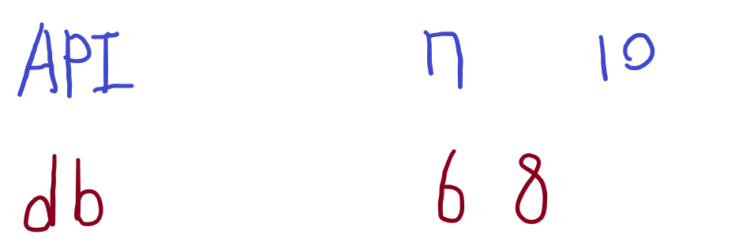
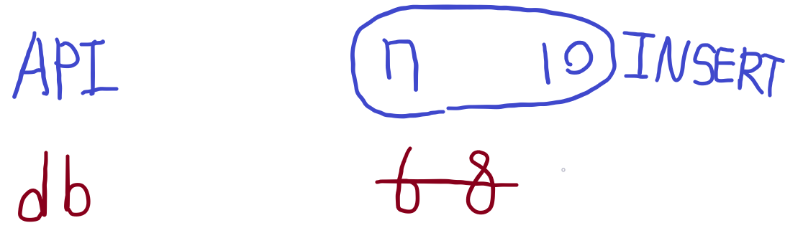
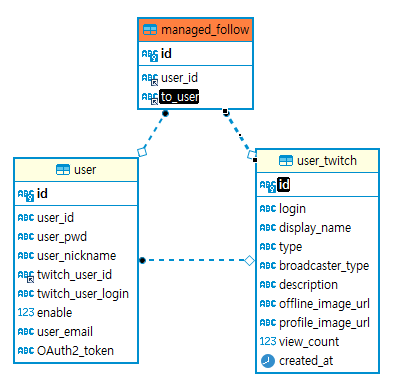
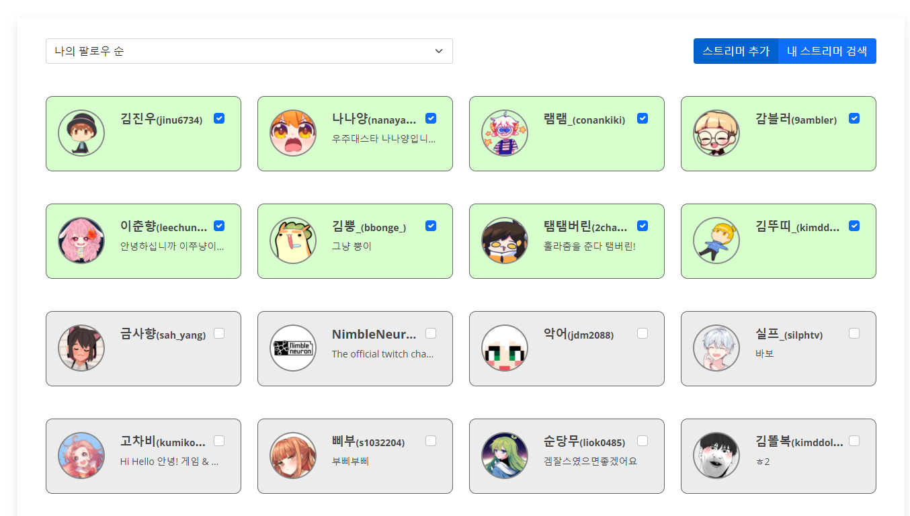

2021.11.07 사용자의 팔로우 데이터 갱신/관리목록 설정하기
====================
## 사용자의 팔로우 데이터 갱신
사용자의 팔로우 목록 데이터가 필요할 때 마다 API에 요청을 하면 많은 시간이 걸리므로, 해당 데이터를 DB에 저장해서 사용하는 방식으로 구현했습니다.       
대신, 로그인 할 때마다 각 순간의 팔로우 데이터를 DB에 갱신할 필요가 있어, 이에대한 처리를 구현하였습니다.

### 트위치 사용자 DB구조
     
기본적인 사용자 테이블과 실제 트위치 사용자 데이터, 그리고 실제 트위치 사용자의 팔로우 데이터의 테이블 구조를 구현하였습니다.     
사용자가 회원가입할 시, 해당 사용자에 대한 데이터가 user_twitch 테이블에 저장됩니다.      
그리고 로그인할 시, 사용자의 팔로우 데이터가 user_follow 테이블에 저장되고, 팔로우 데이터에 해당하는 user_twitch 데이터가 다시 저장됩니다.     
````
public void addUserFollow(UserFollowVO userFollowVO) throws Exception {
    UserTwitchVO read = new UserTwitchVO();
    read.setId(userFollowVO.getFrom_id());
    UserTwitchVO temp = readUserTwitch(read);
    Key key = new Key();
    if(temp == null) {
        TwitchUser user = new GetStream().getUser(key.getClientId(), keyMapper.read("App_Access_Token").getKeyValue(), "id=" + userFollowVO.getFrom_id());
        if(user == null) {
            String app_access_token = new GetToken().requestAppAccessToken(key.getClientId(), key.getCleintSecret());
            keyMapper.update(new TwitchKeyVO("App_Access_Token", app_access_token));
            user = new GetStream().getUser(key.getClientId(), keyMapper.read("App_Access_Token").getKeyValue(), "id=" + userFollowVO.getFrom_id());
        }
        UserTwitchVO userTwitchVO = user.toUserTwitchVO();
        addUserTwitch(userTwitchVO);
    }

    read.setId(userFollowVO.getTo_id());
    temp = readUserTwitch(read);
    if(temp == null) {
        TwitchUser user = new GetStream().getUser(key.getClientId(), keyMapper.read("App_Access_Token").getKeyValue(), "id=" + userFollowVO.getTo_id());
        if(user == null) {
            String app_access_token = new GetToken().requestAppAccessToken(key.getClientId(), key.getCleintSecret());
            keyMapper.update(new TwitchKeyVO("App_Access_Token", app_access_token));
            user = new GetStream().getUser(key.getClientId(), keyMapper.read("App_Access_Token").getKeyValue(), "id=" + userFollowVO.getTo_id());
        }
        UserTwitchVO userTwitchVO = user.toUserTwitchVO();
        addUserTwitch(userTwitchVO);
    }
    userFollowVO.setId(UUID.randomUUID().toString());
    userFollowMapper.create(userFollowVO);
}
````
팔로우를 추가하는 메소드는 위와 같습니다.
팔로우 데이터를 가져온 뒤, 해당 팔로우 데이터에 해당하는 실제 twitch 사용자 데이터가 DB에 존재하면 update, 없으면 insert로 들어가는 구조입니다.      
이를 통해서 팔로우 데이터가 서버에 추가될 때 마다 user_twitch 테이블이 자동으로 갱신되도록 시스템이 구축되었습니다.      


### 로그인 시 마다 데이터 갱신
````
UserFollowVO userFollowVO = new UserFollowVO();
userFollowVO.setFrom_id(tuser.getId());
ArrayList<UserFollowVO> allFollowedList = followGetter.getAllFollowedListToFollowVO(client_id, user_pwd, "from_id=" + tuser.getId()); 	// 갱신할 팔로우 리스트
List<UserFollowVO> userFollowVOS = service.readUserFollowList(userFollowVO);														// db의 팔로우 리스트
HashSet<String> followSet = new HashSet<>();																						// db의 팔로우 리스트의 Set
for (UserFollowVO c_userFollow : userFollowVOS) followSet.add(c_userFollow.getTo_id());
for (UserFollowVO c_userFollowVO : allFollowedList) {
    // 갱신할 값이 이미 db에도 있으면 Set에서 값을 지운다.
    if(followSet.contains(c_userFollowVO.getTo_id())) followSet.remove(c_userFollowVO.getTo_id());
    service.addUserFollow(c_userFollowVO);
}
for (String s : followSet) service.deleteUserFollow(s);
````
로그인의 경우 트위치 계정에서 실시간으로 토큰을 받아, 로그인을 하는 경우와 일반 아이디 비밀번호로 로그인을 하는 경우가 있습니다.    
여기서 일반 아이디 비밀번호로 로그인을 하는 경우, 팔로우 데이터를 가져올 수 없으므로, 갱신되지 않습니다.     
따라서 트위치 계정으로 로그인을 할 때에만 팔로우 데이터가 자동 갱신 됩니다.    
자동갱신 코드의 처리는 다음과 같습니다.     
       
1. 트위치 API에서 해당 사용자에 해당하는 모든 팔로우 목록을 가져옵니다.       

        
2. DB에 저장된 모든 팔로우 목록을 가져와 Set에 저장합니다.

       
3. Set에서 비교하여 두 데이터가 일치하는 값은 Set에서 삭제하고, DB에 해당값을 Update 해줍니다.

      
4. API에는 존재하는데, Set에는 없었던 값은 DB상에 Insert합니다.

        
5. 마지막으로 Set상에 남아있는 값은 DB에서 제거해줍니다.       

위 처리를 로그인 시 마다 진행해줌으로써, 팔로우 데이터를 갱신해줍니다.
위 코드에서, update와 insert 모두 addUserFollow메소드를 사용하는것은 위에서 addUserFollow메소드를 설명할 때에, 이미 DB에 있는 값이면 insert가 아닌, update문을 날리도록 세팅해두었기 때문에 가능합니다.     


## 팔로우 관리목록 설정
이 사이트는 단순 팔로우 데이터가 아닌, 팔로우 목록 중에서도 나만의 관리목록을 생성하여, 해당 스트리머의 클립, 최신 다시보기 등을 별도로 관리하여, 한 눈에 볼 수 있도록 편의성 서비스를 제공합니다.       

### 팔로우 관리목록 DB설계
      
관리목록을 사용하는 사용자는 현 사이트 상의 사용자의 데이터를 참조하고, 관리목록의 대상은 실제 트위치 API상의 사용자 데이터를 참조합니다.      
해당 테이블 구조를 이용해서, 팔로우 목록과 함께, 그 중 관리목록에 등록되어있는 스트리머를 조회하는 쿼리문을 다음과 같이 설계하였습니다.
````
SELECT ut.id ID, ut.login LOGIN, ut.display_name display_name, ut.type type, ut.broadcaster_type brㅗoadcaster_type,
       ut.description description , ut.offline_image_url offline_image_url, ut.profile_image_url profile_image_url,
       ut.view_count view_count, ut.created_at created_at, mf.id managed_id, (mf.id is not null) isManaged
FROM user_follow uf
         left join user_twitch ut on ut.id = uf.to_id
         left join user u on u.twitch_user_id = uf.from_id
         left join managed_follow mf on u.id = mf.user_id and ut.id = mf.to_user
WHERE uf.from_id = #{from_id}
ORDER BY isManaged DESC
````
팔로우 목록을 중심으로, 팔로우 목록에 해당하는 트위치 데이터 테이블값을 가져오고, 그 중 managed_follow 값이 null이 아닌값은 관리목록에 들어있는 값으로 참조하는 컬럼인 isManaged를 추가합니다.      
해당 쿼리문으로 조회하여 뷰단에서는 팔로우 목록 중에서 관리목록에 해당하는 데이터를 조회하여 가져옵니다. 해당 페이지는 다음과 같습니다.      
   
통신은 Ajax를 이용하여, 체크박스를 클릭하면 바로 데이터에 반영되고, 즉시 location.reload()함수로 새로고침되도록 설정하였습니다.       


## 다음 목표
* 관리목록에 해당하는 스트리머의 다시보기/라이브 방송/최신 인기클립 데이터를 가져와서 메인 페이지에 보여주는 부분을 구현
* 모든 데이터를 API에서 가져오지 않고, DB에서 가져오도록 하기 위해서, 각 데이터들을 저장할 DB 테이블을 재구성(기존은 API에서 모두 가져와서 속도가 매우 느렸음)
* 트위치의 데이터셋을 가져와서 데이터 분석하는 다른 서비스를 만들기 위해서, 트위치의 데이터를 가져올 수 있는 쿼리를 설계

