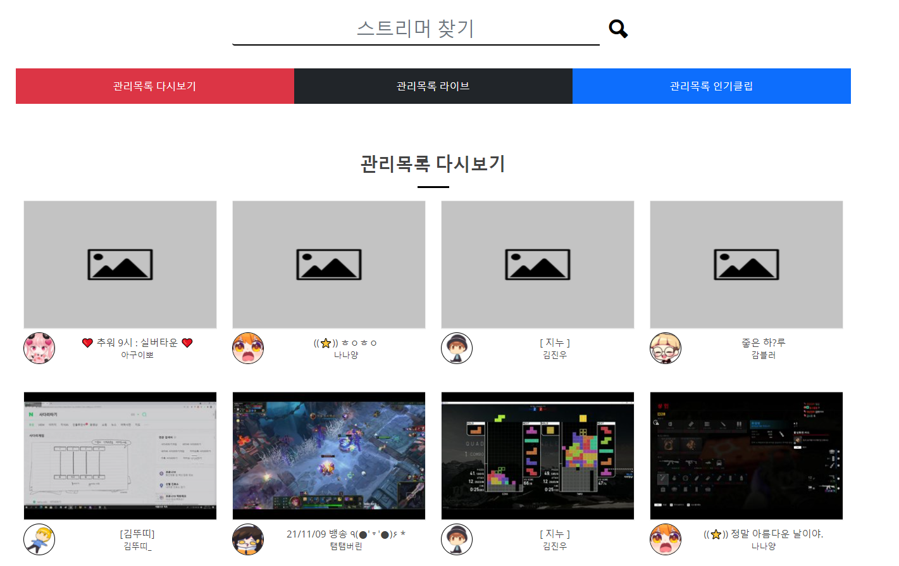
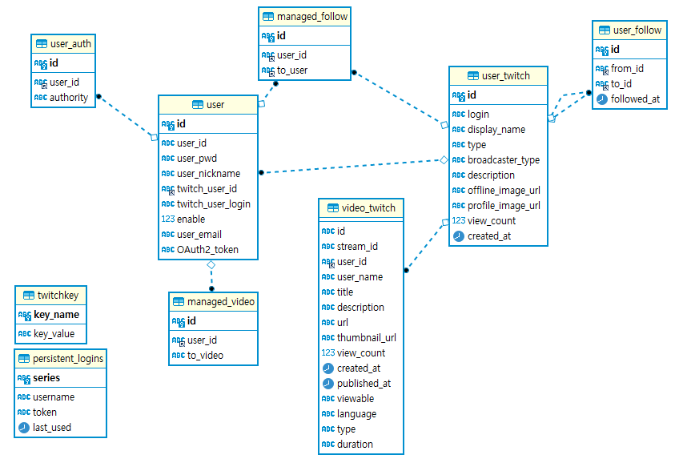

2021.11.10 관리목록 최신 다시보기 가져오기 구현
====================

## 트위치 비디오 가져오기 - 필요할 때 데이터 베이스 넣기
원하는 데이터를 트위치 API에서 불러오는 방법도 좋지만, API 통신이 많아질수록 서버는 느려지게 됩니다.    
이 부분을 해결하기 위해서 사용자가 필요한 비디오 데이터가 사용될 때에, API와 통신하여 DB에 없는 값만큼만 가져오도록 설정하였습니다.   
````
List<ManagedFollowVO> follow_list = managed_service.listFollow(user.getId());
for (ManagedFollowVO managedFollowVO : follow_list) {
    List<VideoTwitchVO> service_video = service_video = videoGetter.getRecentVideo(client_id, key.read("App_Access_Token").getKeyValue(),
            "?user_id="+managedFollowVO.getTo_user()+"&first=100");
    if(service_video != null) {
        for (VideoTwitchVO videoTwitchVO : service_video) {
            VideoTwitchVO dbSearch = videoTwitchService.read(videoTwitchVO);
            if(dbSearch == null) { // 비디오값이 DB에 들어있지 않는 동안 트위치 API에서 데이터를 계속 가져와서 DB에 추가한다
                videoTwitchService.create(videoTwitchVO);
            } else break;
        }
    }
}
````
1. 팔로우 관리목록을 모두 가져온다.
2. 해당 관리목록을 for문으로 돌면서 각 스트리머의 최신 다시보기 영상 데이터를 가져온다.
3. db와 쿼리하여, 각 비디오 데이터가 db에 존재하지 않으면, 하나씩 db에 추가한다.
4. 이미 db에 있다면 break를 통해 for문을 빠져나간다.

위 코드를 통해서, db에 없는 데이터를 db에 계속 추가해줄 수 있다.
다만, 비디오 데이터 하나당 두 번의 쿼리(read, create)가 들어가기 때문에, 비디오 Map을 생성하여, read만 한번에 처리하는 방법이 더 속도가 빠른지는 생각해 볼 부분이다.       


### 관리목록의 스트리머의 최신 다시보기 가져오기
     
현재까지 구현한 DB 구조는 위와 같다. 여기서 다시보기(video) 데이터 중에서 관리목록에 들어있는 스트리머의 데이터만 가져오기 위해서는 다음과 같은 과정이 필요하다.     
1. 팔로우 데이터를 조회(managed_follow) - 현재 사용자의 데이터를 조회함
2. 해당 팔로우 데이터에 해당하는 트위치 사용자 정보(user_twitch)를 조회 (조인1)
3. 트위치 사용자의 다시보기 정보(video_twitch)를 최신순으로 조회

위를 조인을 통해서 구현한 것이 다음 쿼리문이다.
````
SELECT vt.id, vt.stream_id,vt.user_id, vt.user_name , vt.title , vt.description, vt.url, vt.thumbnail_url, vt.view_count , vt.created_at , vt.published_at ,vt.viewable
     ,vt.`language` ,vt.`type` ,vt.duration, ut.profile_image_url profile_image_url
FROM managed_follow mf
         LEFT JOIN user_twitch ut ON mf.to_user = ut.id
         LEFT OUTER JOIN video_twitch vt ON vt.user_id = ut.id
WHERE mf.user_id = #{user_id}
<if test="created_at    !=null">AND vt.created_at <![CDATA[<]]> #{created_at}</if>
ORDER BY vt.created_at DESC limit #{limit}
````
여기서 다시보기 영상은 영상 개수만큼 표시되어야 하기 때문에 LEFT OUTER JOIN을 사용한 것을 볼 수 있다.      
또한 특정 개수만큼만 조회를 하고, 나머지 데이터는 더보기 Ajax로 추가하게 된다.     
이 때, created_at 데이터를 통해서 이전 조회한 데이터 중 가장 마지막 영상보다 이전 영상을 조회하도록 조건문을 추가하여, 인덱스없이 더보기 기능을 구현할 수 있다.        


## 다음 목표
* 관리목록에 해당하는 스트리머의 다시보기/라이브 방송/최신 인기클립 데이터를 가져와서 메인 페이지에 보여주는 부분을 구현
* 모든 데이터를 API에서 가져오지 않고, DB에서 가져오도록 하기 위해서, 각 데이터들을 저장할 DB 테이블을 재구성(기존은 API에서 모두 가져와서 속도가 매우 느렸음)
* 트위치의 데이터셋을 가져와서 데이터 분석하는 다른 서비스를 만들기 위해서, 트위치의 데이터를 가져올 수 있는 쿼리를 설계

