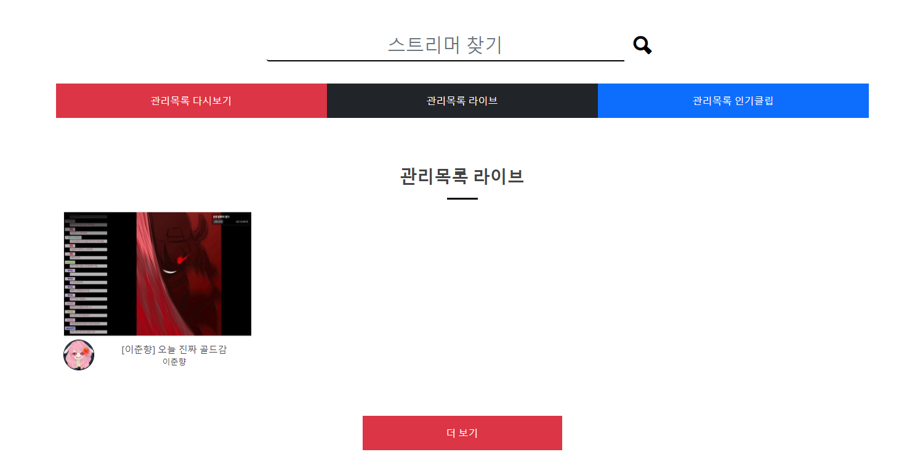

2021.11.12 관리목록 라이브 가져오기 구현
====================

## 라이브 데이터 가져오기 
기록되어있는 비디오나 클립 데이터에 비해서, 라이브 데이터는 계속해서 변하는 동적 데이터입니다.     
때문에 이를 DB에 저장하여 가져오는 방법은 무리가 있고, 지속적으로 API와 통신하여 현재 라이브 중인 목록을 가져올 필요가 있습니다.
````
List<ManagedFollowVO> follow_list = managed_service.listFollow(user.getId());
String client_id = twitchKey.getClientId();

for(int i=0;i<follow_list.size();i++) {
    Stream s = streamGetter.getLiveStream(client_id, user.getOauth_token(), follow_list.get(i).getTo_user(), "");

    if(s != null) {
        UserTwitchVO searchUser = new UserTwitchVO();
        searchUser.setId(follow_list.get(i).getTo_user());
        UserTwitchVO read = userTwitchMapper.read(searchUser);
        s.setThumbnail_url(s.getThumbnail_url().replace("{width}", "300").replace("{height}", "200"));
        s.setProfile_image_url(read.getProfile_image_url());
        JSONObject res_ob = s.StreamToVideo().parseToJSONObject();
        res_arr.add(res_ob);
    }
}
````
1. 팔로우 관리목록을 모두 가져온다.
2. 관리목록을 돌면서, 해당 사용자가 현재 라이브중인지 여부를 파악한다.
3. 라이브 중이라면, 해당 사용자의 데이터와 라이브 정보를 합쳐서 반환한다.

트위치 API와 직접 통신하는 경우, DB와 비교하여 확인하는 별도의 동작이 필요하지 않기 떄문에, 더 간단하게 구현할 수 있습니다.    


## 다음 목표
* 관리목록의 인기클립 가져오기 구현
* 검색기능 재 구현
* 트위치 사용자 상세보기 페이지서 사용자에 대한 데이터를 데이터셋을 활용하여 분석하기
* 트위치의 데이터셋을 가져와서 데이터 분석하는 다른 서비스를 만들기 위해서, 트위치의 데이터를 가져올 수 있는 쿼리를 설계

