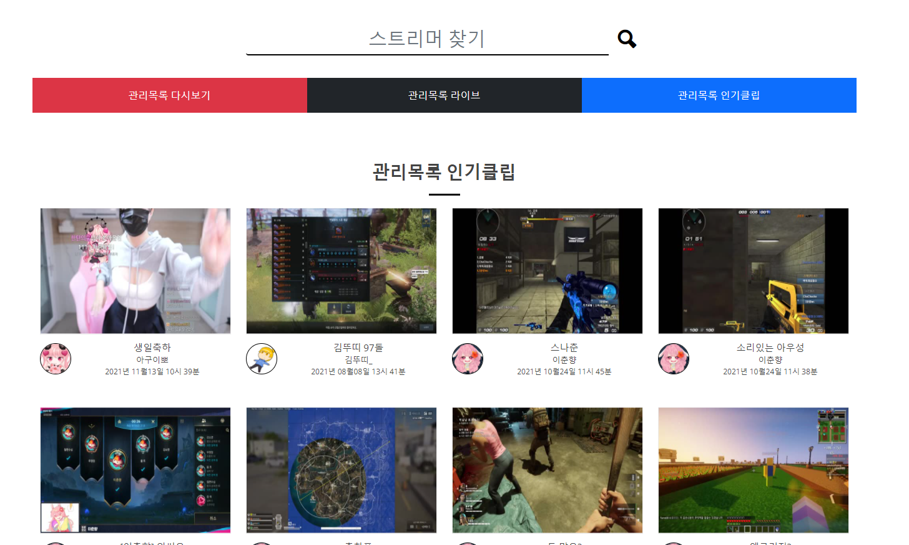
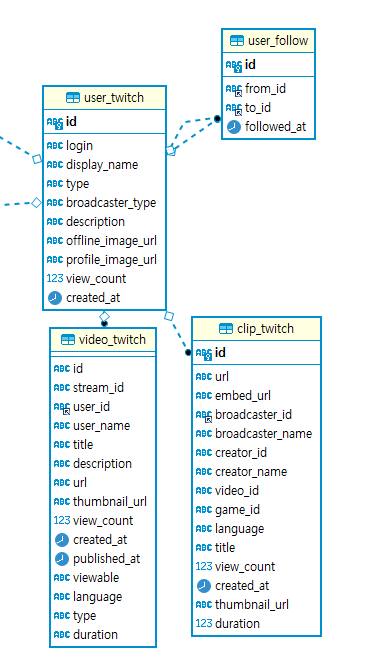
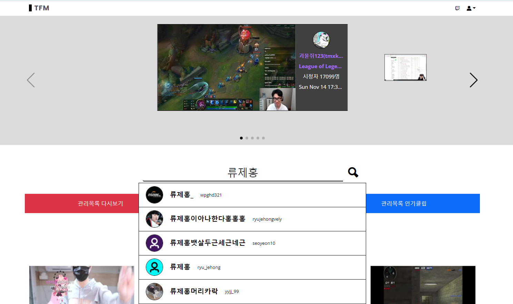
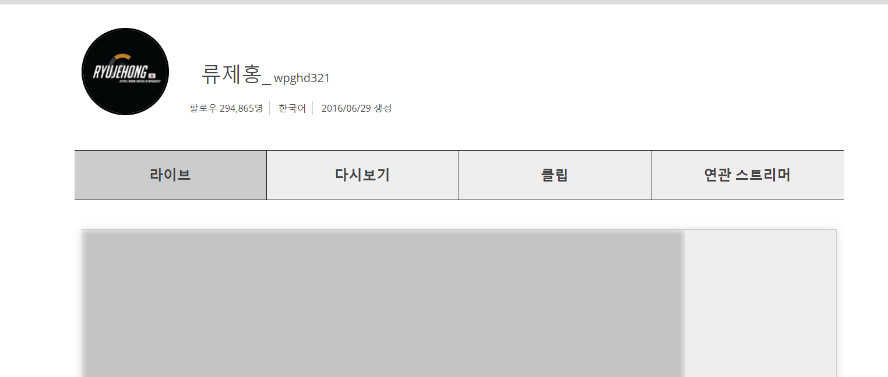

2021.11.14 관리목록 인기클립 구현
====================
## 인기클립 가져오기

트위치 API에서 클립은 라이브/비디오와 별개의 데이터로 취급되며, 클립 쿼리를 별도로 날려서 가져올 수 있다.      
그러므로 클립에 대한 DB 테이블을 별도로 생성하여, 비디오와 마찬가지로 세팅되도록 하였다.      
     
클립 데이터에서는 broadcaster_id, creator_id 뿐 아니라 game_id와 같이 게임 데이터도 외래키로 지정하여야 되어서,      
연동될 또 별도의 테이블이 필요한데, 해당 데이터와 관련된 서비스는 아직구현하지 않으므로, 이에 대한 테이블 연결도 구현하지 않았다.    
여기서, 최신인기클립을 조회하는 기준을 재생수/오늘날짜에서 멀어진 일 수 로 식을 잡았다.      
해당 식에 따라서 포인트를 계산하여, 포인트로 정렬하도록 SQL문을 구성하였다. SQL문은 다음과 같다.     
````
SELECT ct.id, ct.url, ct.embed_url, ct.broadcaster_id, ct.broadcaster_name, ct.creator_id, ct.creator_name, ct.video_id,
ct.game_id, ct.language, ct.title, ct.view_count, ct.created_at, ct.thumbnail_url, ct.duration, ut.profile_image_url profile_image_url,
(ct.view_count /(dayofyear(now()) - dayofyear(ct.created_at) + ((year(now()) - year(ct.created_at)) * 365 ))) points
FROM managed_follow mf
LEFT JOIN user_twitch ut ON mf.to_user = ut.id
LEFT OUTER JOIN clip_twitch ct ON ct.broadcaster_id = ut.id
WHERE mf.user_id = '991a2a25-ab5d-4d2c-b772-60f0bf85ab35'
<if test="points    !=null">AND (ct.view_count /(dayofyear(now()) - dayofyear(ct.created_at) + ((year(now()) - year(ct.created_at)) * 365 ))) <![CDATA[<]]> #{points}</if>
ORDER by points desc limit #{limit};
````    
위 쿼리문에서 생각해보아야 할 점은, limit로, 원하는 만큼만 데이터를 가져온 뒤에, 더보기를 클릭했을 때, 해당 값의 이후 데이터를 가져와야한다는 부분인데,     
여기서 포인트가 들어올 경우에, 해당 계산식을 한번 더 수행하여, 들어온 포인트보다 낮은 수를 다시 포인트 순으로 정렬하는 방법을 사용하였다.    
식 자체는 길지만, 큰 연산이 필요하지 않으므로 쿼리에 대한 속도는 크게 변화가 없었다.     
다만, 홈 화면을 갈 때마다 데이터를 업데이트 하는 구조이므로, API를 최소 한번씩은 확인하기 때문에, 해당 부분에서 시간이 많이 들어갔다.       
이 부분에 대해서는 정기적으로 데이터를 업데이트 시키는 방식으로 구현하거나, 원하는 버튼을 클릭했을 때,    
혹은 팔로우 데이터를 갱신할 때(로그인할 시) 클립과 다시보기 데이터를 함께 갱신하고, 이후에는 갱신버튼을 클릭하지 않으면 별도의 갱신작업을 하지 않도록 세팅할지 고민이 필요하다.     

이외의 나머지 구현은 이전의 라이브 데이터 가져오기와, 다시보기 데이터를 가져오는 코드와 완전히 동일하다.     
    
    
추가로 검색기능은 인증코드만 등록해주었더니 정상적으로 작동하였다.      
데이터 상세보기에서 정보를 가져오는 부분과, 스크립트만 추가적인 구현이 필요하다.     
그리고 해당 상세보기 부분에서 위에서 언급한 데이터 새로구침 기능을 구현하여, 해당 스트리머에 대한 데이터를 DB로 불러올 수 있도록 코드를 작성할 예정이다.      
각 스트리머당 필요한 데이터는 다음과 같다.    
* 해당 스트리머의 클립 데이터
* 해당 스트리머의 다시보기 데이터
* 해당 스트리머가 팔로우 한 사용자 데이터(to_follow)
* 해당 스트리머를 팔로우 한 사용자 데이터(from_follow)

여기서 데이터 업데이트 공식은 이전에 HashSet을 사용한 방식을 사용하였는데, 연산의 속도를 위하여 배열을 사용하여 index를 체크하는 방식으로 변경할 예정이다.     
자세한 구현방법은 해당 부분을 구현할 때 작성하도록 하겠다.


## 다음 목표
* 트위치 사용자 상세보기 페이지서 사용자에 대한 데이터를 데이터셋을 활용하여 분석하기
* 트위치의 데이터셋을 가져와서 데이터 분석하는 다른 서비스를 만들기 위해서, 트위치의 데이터를 가져올 수 있는 쿼리를 설계

