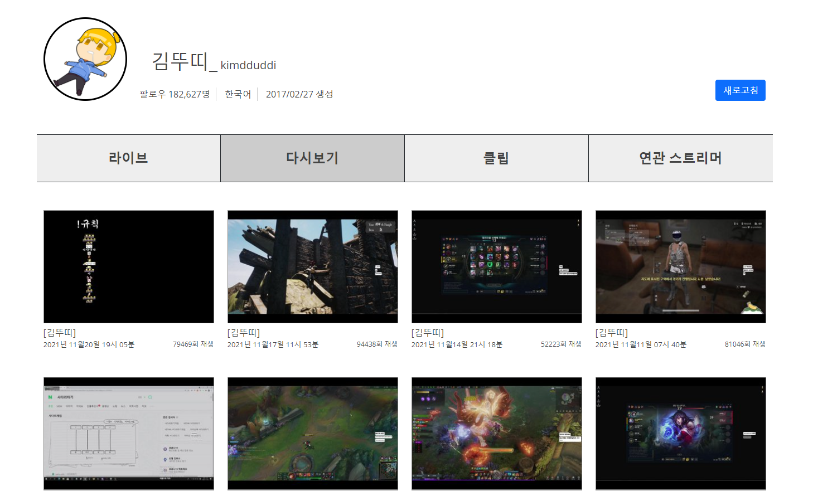
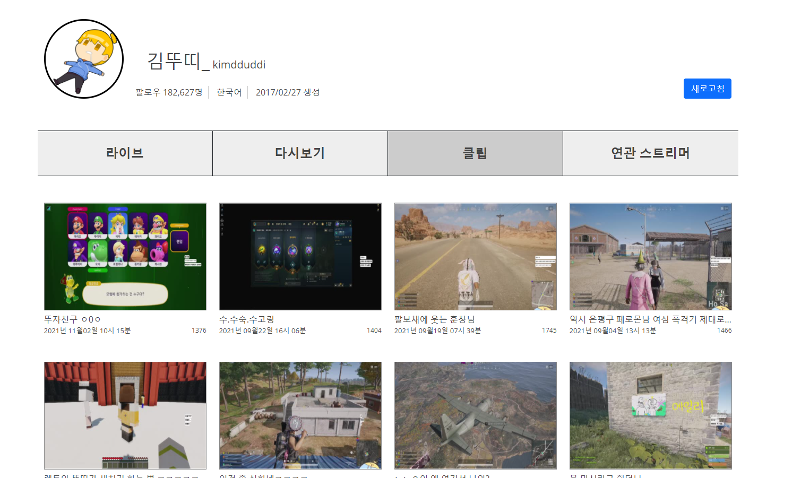

2021.11.23 스트리머 상세보기 다시보기/클립 데이터 가져오기
====================
## 다시보기 가져오기

상세보기 페이지에서는 API와 직접적으로 데이터를 주고받는 과정을 생략하고, DB에서 바로 데이터를 가져온다.    
보다 빠른 성능으로 데이터 조회가 가능하다.   
다만 DB에 아직 들어오진 정보는 조회되지 않으므로, 이 부분을 해결하기 위해서 새로고침 버튼을 생성하여 데이터를 가져올 수 있도록 하였다.      
메인 페이지에서 느린 쿼리도 이와 같은 방법을 사용할 예정이다.        

# 클립 가져오기
     
클림 데이터도 다시보기 데이터와 마찬가지로 DB에서만 값을 가져오는 방식을 사용하여 쿼리가 훨씬 빨라졌다.
해당 페이지에서는 기존의 페이징 방식과 다른, OFFSET과 LIMIT을 활용한 방식을 사용하였다.     
보다 간단하게, 직관적으로 데이터를 가져올 수 있는 방법을 지원한다.      
또한 where부분을 Mybatis 동적쿼리를 적용하였습니다. 쿼리문은 다음과 같다.        
````
SELECT id
     , url
     , embed_url
     , broadcaster_id
     , broadcaster_name
     , creator_id
     , creator_name
     , video_id
     , game_id
     , language
     , title
     , view_count
     , created_at
     , thumbnail_url
     , duration
FROM clip_twitch
<where>
    <if test="broadcaster_id    !=null">AND broadcaster_id = #{broadcaster_id}</if>
    <if test="broadcaster_name  !=null">AND broadcaster_name = #{broadcaster_name}</if>
</where>
ORDER BY created_at DESC
LIMIT #{page} OFFSET #{index}
````


## 다음 목표
* 데이터 새로고침으로 데이터를 가져오는 부분 구현하기
* 해당 스트리머의 연관 스트리머 데이터를 조회할 수 있는 쿼리문 만들기 (많은 팔로우 사용자에 대비해서 효율적으로 조회하는 방법 설계하기)
* 트위치의 데이터셋을 가져와서 데이터 분석하는 다른 서비스를 만들기 위해서, 트위치의 데이터를 가져올 수 있는 쿼리를 설계

