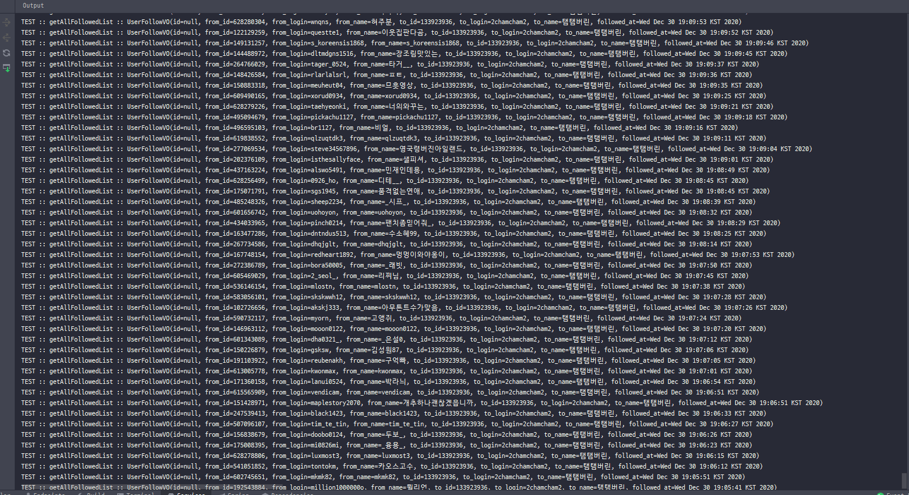

2021.11.24 데이터 새로고침 구현
====================
## 다시보기 가져오기

위에서 버튼 형태만 구현해두었던 데이터 새로고침 기능을 구현하였다.     
버튼 클릭시, 실시간으로 스트리머에 대한 데*이*터들이 새로고침되면서, DB에 반영되도록 한다.      

# 클립 가져오기
     
여기서 문제점이 발생했다.     
다시보기 데이터나 클립 데이터는 개수가 많지 않아서 불러오는데 많은 시간이 걸리지 않았다.     
하지만 스트리머의 팔로우 데이터를 가져오는 경우에,      
개인 한 명이 스트리머 1000명 이상 구독하는 경우는 많지않아 상관이 없지만,    
흔히 대기업이라고 불리우는 많은 시청자를 가진 스트리머들은 팔로우가 10만명 단위이기 때문에, API를 통해서 이 인원을 모두 일일이 가져오는 데에 시간이 너무 오래걸렸다.       
대략적으로 50만명을 가져오는데 약 40분의 시간이 필요할 것으로 예상되어 해당 방법은 실질적으로 사용이 어렵다.      
떄문에 스트리머 팔로우 데이터를 기반으로 하는 "연관 스트리머" 기능은 사용이 어려울 듯 하다.       

이를 대신해서 스트리머간의 개인 팔로우 데이터를 사용해서,      
예를들어, A와 B가 서로 맞 팔로우 상태인데, 여기서 C라는 스트리머도 A,B와 맞 팔로우 상태일 경우
A,B,C 간의 연관 점수가 높아지는 방식으로, 서로서로 연관되어있는 정도를 점수로 계산해서 나타내는 방식은 유효할 듯 하다.       
그래서 이 방법을 구현하는것을 다음 목표로 삼는다.

## 다음 목표
* 스트리머 연관정보 데이터 셋 계산식 구성하기

