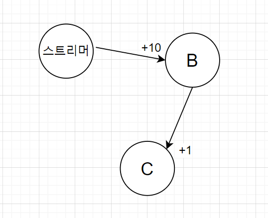
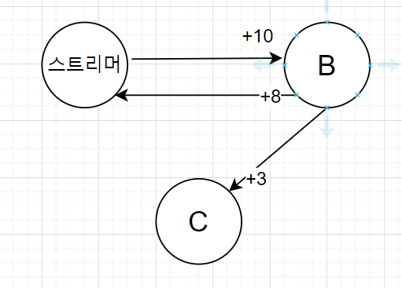

2021.11.28 스트리머 연관정보 데이터 가져오기
====================
## 스트리머 연관정보 데이터 식
스트리머의 연관정보를 가져오기 위한 계산식을 작성했다.        
         
스트리머를 기준으로하여 점수를 측정하는 방식이다.       
- 스트리머가 B라는 스트리머를 팔로우했다면, 연관점수 10점을 추가한다.
- 해당 스트리머 B가 팔로우한 스트리머 C에게는 연관점수 1점을 추가한다.       

     
- 스트리머와 B 스트리머가 서로 맞팔로우 관계라면, 연관점수를 추가로 8점 추가한다.
- 여기서 B가 팔로우한 스트리머 C에게도 2점을 추가한다.    

위 방식을 통해서 점수가 높은 순으로, 스트리머를 조회하여 가져오는 방식으로 구현하였다. 코드는 다음과 같다.     
````
List<UserFollowVO> followVOList = userService.readUserFollowList(new UserFollowVO());
HashMap<String, List<UserFollowVO>> followMap = new HashMap<>();
for (UserFollowVO userFollowVO : followVOList) {
    if(!followMap.containsKey(userFollowVO.getFrom_id())) {
        List<UserFollowVO> l = new ArrayList<>();
        l.add(userFollowVO);
        followMap.put(userFollowVO.getFrom_id(), l);
    } else {
        followMap.get(userFollowVO.getFrom_id()).add(userFollowVO);
    }
} 
// DB에서 모든 팔로우 데이터를 가져와서 Map에 넣음
List<UserTwitchVO> userList = userService.readUserTwitchList(new UserTwitchVO());
HashMap<String, UserTwitchVO> userMap = new HashMap<>();
for (UserTwitchVO ut : userList) userMap.put(ut.getId(), ut);
// DB에서 모든 트위치 사용자 데이터를 가져와서 Map에 넣음
// /DB에서 가져온 값 컬렉션 초기화

List<UserFollowVO> sTof = followMap.get(body);      // 스트리머의 팔로우 목록 가져오기
HashMap<String, Integer> map = new HashMap<>();
if(sTof != null) {
    for (UserFollowVO f : sTof) {
 
        if (map.containsKey(f.getTo_id())) map.replace(f.getTo_id(), map.get(f.getTo_id()) + 10);
        else map.put(f.getTo_id(), 10);
        // 스트리머가 팔로우 한 대상 리스트 => +10점

        List<UserFollowVO> fTof = followMap.get(f.getTo_id());
        if (fTof != null) {
            for (UserFollowVO ff : fTof) {
                int addFlag = 0;
                // 팔로우한 대상이 스트리머를 팔로우 했으면 +8점, 맞팔로우이므로 추가 2점 플래그를 넣음
                if (ff.getTo_id().equals(body)) {
                    map.replace(f.getTo_id(), map.get(f.getTo_id()) + 8);
                    addFlag = 2;
                }

                // 팔로우한 대상이 팔로우 한 리스트 => +1점 (팔팔에게만), 맞팔로우 상태라면 추가 2점
                if (map.containsKey(ff.getTo_id())) map.replace(ff.getTo_id(), map.get(ff.getTo_id()) + 1 + addFlag);
                else map.put(ff.getTo_id(), 1);

            }
        }
    }
}
ArrayList<String> tempList = new ArrayList<>();
for (String s : map.keySet()) if(!s.equals(body)) tempList.add(s);
Collections.sort(tempList, (a,b) -> {return map.get(b) - map.get(a);}); // map에 기록된 점수에 따라서 리스트를 정렬함
````
연산을 활용한 결과, 시간복잡도 적으로는 모든 팔로우 데이터와 사용자 데이터를 DB에서 가져와, Map에 삽입하는 부분에서 약간의 시간이 걸리고,        
실제 계산시간은 최소화하였다. 필요한 데이터마다 Select쿼리를 불러서 DB에서 가져오는 방법도 시험해보았으나, 데이터를 가져오는데에 몇천번의 쿼리가 발생하여 비효율적이라고 판단되었다.           
최종적으로 해당 메소드가 실행되는데에 약 5초~10초 정도의 시간이 걸렸다.          
정확도 측면에서 봤을때, 계산식에서 팔로우의 팔로우 스트리머까지 점수를 추가하는 과정에서, 해당 스트리머와는 관계가 없지만, 그저 인기가 많아서 많은 팔로우수를 기록하는 스트리머들이 상위권에 위치하는 현상이 나타났다.     
다만 연관관계 데이터를 분석하는 부분에서, 단순한 계산식으로, 관계가 없지만, 인기가 많아 직/간접 팔로우 되는 스트리머들을 제외할 수 있는 방안을 현재로써 마련하기 어렵다는 결론을 내렸다.     


## 다음 목표
* 데이터 새로고침 수정 및 속도 개선 
* 전체 페이지 로딩 추가하기
* 메인 페이지 새로고침 버튼 추가하기
* 로그인 시, 사용자에게 일부 페이지가 노출되는 부분 방지하기
* 다시보기 찜 관리 부분 구현
* 스트리머 연관정보를 이용한, 다시보기/클립의 연관 비디오 가져오기
* 다시보기/클립을 사이트 내에서 보여줄 수 있는 방법 찾기

