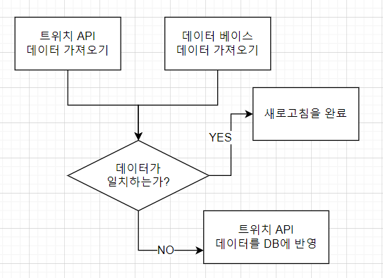

2021.12.01 데이터 새로고침 수정 및 속도개선
====================
## 데이터 새로고침 수정 및 속도개선
기존 데이터 새로고침의 경우, 다음 맵과 같이 구성되었다.      
       
맵 자체는 단순하지만, 트위치 API를 DB에 반영하는 과정에서, 약 수천개에서 많게는 수만개의 다시보기, 클립, 팔로우 데이터들이 각각 트위치 API에서 쿼리를 통해 가져와지고, 각각이 별도로 INSERT문으로 DB에 추가되었다.      
이 때문에 새로고침 한번에 몇천개에서 몇만개의 INSERT, DELETE문이 실행되는 현상이 생겨 새로고침 한 번에 약 10분~20분 정도의 시간이 걸려 정상적인 기능을 하지 못하였다.        
이를 해결하기 위해서 INSERT와 DELETE를 리스트로 한번에 실행하는 방법을 고안하였다.


## 리스트를 INSERT, DELETE하기
````
<insert id="createList" parameterType="VideoTwitchVO">
    INSERT INTO video_twitch(
                             id,
                             stream_id,
                             user_id,
                             user_name,
                             title,
                             description,
                             url,
                             thumbnail_url,
                             view_count,
                             created_at,
                             published_at,
                             viewable,
                             language,
                             type,
                             duration
                             )
    VALUES
    <foreach collection="list" item="uv" index="index" separator=",">
        (
         #{uv.id},
         #{uv.stream_id},
         #{uv.user_id},
         #{uv.user_name},
         #{uv.title},
         #{uv.description},
         #{uv.url} ,
         #{uv.thumbnail_url},
         #{uv.view_count},
         #{uv.created_at},
         #{uv.published_at},
         #{uv.viewable},
         #{uv.language},
         #{uv.type},
         #{uv.duration}
         )
    </foreach>
</insert>
````
모든 데이터 연산을 리스트로 변경하였고, 그 중 하나인 다시보기 데이터 쿼리문이다.         
mybatis에서 지원하는 foreach문을 사용해서, 리스트로 들어온 값을 하나하나 INSERT의 VALUES에 등록할 수 있도록 하였다.    
````
<delete id="deleteList" parameterType="String">
    DELETE FROM video_twitch
    <where>
        FIND_IN_SET(user_id, #{ids})
    </where>
</delete>
````
DELETE문의 경우에는 FIND_IN_SET() 함수를 사용하여, ","로 구분되는 문자열을 한번에 받아와, 해당 id에 해당하는 값들만 제거하는 방식을 사용하였다.
해당 쿼리문을 통해서, 여러개의 값이 INSERT, DELETE되더라도, 쿼리문 자체는 한번만 실행하여 여러번의 쿼리문이 발생하지 않도록 방지함으로써, 쿼리 속도를 향상시켰다.      

## 팔로우 데이터 새로고침 문제
이전에 새로 작성한 스트리머 연관관계 데이터 가져오기에서는 스트리머가 팔로우한 스트리머 B, 그리고 그 B가 팔로우한 C를 중심으로 점수를 부여하여 계산하였다.     
이를 위해서는 데이터 새로고침시에 해당 스트리머의 팔로우 정보 뿐 아니라, 스트리머가 팔로우한 B의 모든 팔로우 데이터 역시 새로고침 될 필요가 있었다.     
그러나, 모든 B의 팔로우 데이터까지 조회하기위해 트위치 API에 지나치게 많은 요청을 보내야 했고, 이 때문에 다시 새로고침 속도가 지나치게 느려지는 현상이 발생했다.

````
ArrayList<UserFollowVO> fromFollows = followGetter.getAllFollowedList(client_id, app_access_token, "from_id=" + userId);
// 트위치 API에서 스트리머의 팔로우 목록을 가져온다.
if(fromFollows != null) {
    List<UserFollowVO> addFollows = new ArrayList<>();
    List<String> delFollows = new ArrayList<>();
    UserFollowVO findu = new UserFollowVO();
    findu.setFrom_id(userId);
    List<UserFollowVO> ffs = userService.readUserFollowList(findu);
    Collections.sort(fromFollows, (a,b) -> {return a.getFollowed_at().compareTo(b.getFollowed_at());});
    Collections.sort(ffs, (a,b) -> {return a.getFollowed_at().compareTo(b.getFollowed_at());});
    // DB에 저장되어있는 팔로우 목록을 가져와서, 각 리스트를 정렬한다.
    
    left = 0;
    right = 0;
    while(left < fromFollows.size() && right < ffs.size()) {
        UserFollowVO taf = fromFollows.get(left);
        UserFollowVO df = ffs.get(right);

        if(!taf.getTo_id().equals(df.getTo_id())) {
            if(taf.getFollowed_at().compareTo(df.getFollowed_at()) <= 0) {
                addFollows.add(taf);
                left++;
               // 트위치 API 목록에서 가져온 값이 더 앞의 값이면(DB에 없을경우) insert 목록에 넣는다.
            } else {
                right++;
                // DB 목록에서 가져온 값이 더 앞의 값이면(DB에만 있을경우) delete 목록에 넣는다.
            }
        } else {
            left++;
            right++;
            // 같으면 패스
        }
    }
    while(left < fromFollows.size()) addFollows.add(fromFollows.get(left++));
    while(right < ffs.size()) delFollows.add(ffs.get(right++).getId());
    if(addFollows.size() > 0) userService.addUserFollowList(addFollows);
    if(delFollows.size() > 0) userService.deleteUserFollowList(delFollows);
}
````
그래서 위와같은 코드로, 일단 새로고침 자체는 해당 스트리머의 팔로우 목록만을 새로고침하는 형태로 지정하였다.      
B의 팔로우목록까지 모두 가져오는 방법은 단순히 가져와야하는 데이터의 절대개수가 지나치게 늘어남에따라 속도가 느려지는 문제이기 때문에, 다른 해결방법을 찾기 어려웠다.     
이로 인해서, 생길 수 있는 문제는 새로고침을 하더라도 연관 스트리머 데이터는 최신화가 되지 않을 수 있다는 부분이다.     
모두 최신화를 하기 위해서는 해당하는 모든 스트리머의 페이지로 이동하여, 새로고침을 할 수 밖에 없다.


## 다음 목표
* 전체 페이지 로딩 추가하기
* 메인 페이지 새로고침 버튼 추가하기
* 로그인 시, 사용자에게 일부 페이지가 노출되는 부분 방지하기
* 다시보기 찜 관리 부분 구현
* 스트리머 연관정보를 이용한, 다시보기/클립의 연관 비디오 가져오기
* 다시보기/클립을 사이트 내에서 보여줄 수 있는 방법 찾기
* 트위치 클립 쇼츠 만들기 (최근 영상 기준, 인기영상 기준, 안본 영상 기준)
