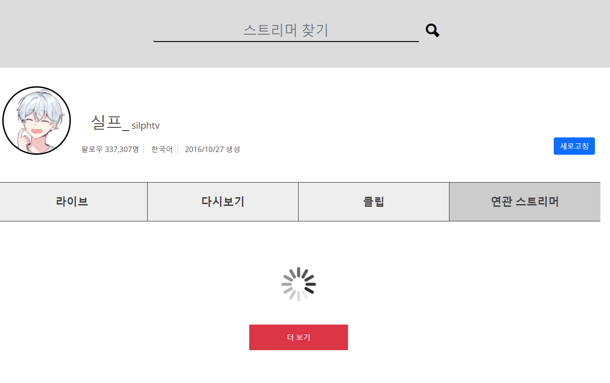
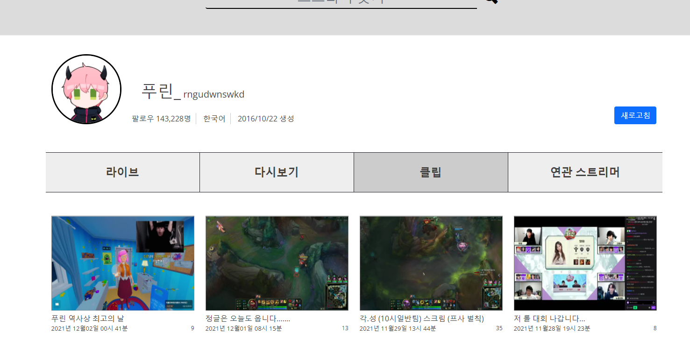

2021.12.02 스트리머 상세보기 페이지 로딩창과 새로고침 추가기능
====================
## 스트리머 상세보기 페이지의 로딩 구현
스트리머 상세보기 페이지에서 데이터를 가져오는 중, 로딩 이미지가 표시되도록 박스를 추가하였다.        
       
연관 스트리머를 가져오는 쿼리에서 많은 양의 쿼리가 발생하기 때문에, 약 5초에서 10초정도의 시간이 걸린다.    
해당 시간만큼 사용자에게 보여지는 부분이 없기 때문에 로딩 박스를 추가하였다.     
이후에 메인페이지도 역시 쿼리하는 중간에 박스가 비기 때문에, 로딩 박스를 추가할 예정이다.

## 데이터 새로고침에 스트리머 자신의 데이터도 업데이트 되도록 기능 추가
  
기존 데이터 새로고침 기능에서는, 스트리머의 다시보기, 클립, 팔로우 데이터는 가져오지만,     
정작 스트리머 본인의 데이터는 갱신되지 않았다.      
이로인해서 발생되는 문제는 닉네임이나, 소개글, 상태글이 변경되었을 경우 갱신되지 않고,     
가장 큰 문제는 프로필 변경시에 트위치의 프로필 실 파일이 제거됨에 따라 사용자에게 프로필 이미지가 보이지 않는 현상이 생겼다.      
데이터 새로고침에서 스트리머 본인의 데이터도 DB상에서 업데이트 되도록 설정하여 해결하였다.     

추가로 트위치 영상을 사이트 내에서 보여줄 수 있는 부분만 찾을 수 있다면,     
나의 관리목록 스트리머들의 최근 인기클립들을 유튜브 쇼츠처럼 쉽게 넘기면서 한번에 볼 수 있도록 편의성을 제공하는 기능을 구현할 예정이다.

## 다음 목표
* 메인 페이지 로딩 추가하기
* 메인 페이지 새로고침 버튼 추가하기
* 로그인 시, 사용자에게 일부 페이지가 노출되는 부분 방지하기
* 다시보기 찜 관리 부분 구현
* 스트리머 연관정보를 이용한, 다시보기/클립의 연관 비디오 가져오기
* 다시보기/클립을 사이트 내에서 보여줄 수 있는 방법 찾기
* 트위치 클립 쇼츠 만들기 (최근 영상 기준, 인기영상 기준, 안본 영상 기준)
