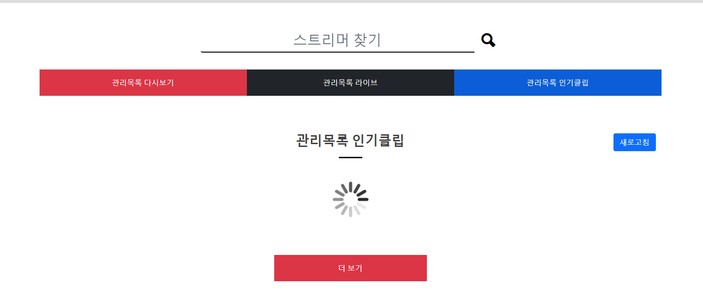

2021.12.06 메인페이지 로딩창 및 새로고침 구현
====================
## 메인페이지 로딩창 구현
       
메인페이지에 데이터를 불러오기 이전에 약간의 시간동안 비어있는 창을 로딩창으로 채울 수 있도록 구현하였다.   
이외에도 더보기를 클릭 시에, 기다리는 동안에도 마찬가지로 로딩창이 생긴다.


## 메인페이지 데이터 새로고침 구현
메인페이지 데이터 새로고침의 경우에는, 상세보기 데이터 가져오기 새로고침 기능을 어느정도 따라 사용하지만,     
최신 데이터만 갱신하면 되므로, 많은 시간이 필요하지 않도록 최근 일부 데이터만 가져와서 없는 데이터를 insert만 시키는 방식으로 코드를 작성하였다.
코드는 다음과 같다.     
````
for (ManagedFollowVO managedFollowVO : follow_list) {
    String userId = managedFollowVO.getTo_user();
    List<ClipTwitchVO> clips = clipGetter.getClips(client_id, app_access_token, "broadcaster_id="+userId+"&first=100");
    if(clips != null) {
        List<ClipTwitchVO> addClips = new ArrayList<>();
        ClipTwitchVO findc = new ClipTwitchVO();
        findc.setBroadcaster_id(userId);
        findc.setPage(100);
        findc.setIndex(0);
        List<ClipTwitchVO> cos = clipTwitchService.readList(findc);
        HashSet<String> cosSet = new HashSet<>();
        for (ClipTwitchVO co : cos) {
            cosSet.add(co.getId());
        }
        for (ClipTwitchVO co : cos) {
            if(!cosSet.contains(co.getId())) addClips.add(co);
        }
        if(addClips.size() > 0) clipTwitchService.createList(addClips);
    }
}
````
HashMap에 데이터베이스에서 최근 데이터 일부만 가져오고, 그 이후의 비디오 데이터만 새로 가져오도록 하였다.    
모든 데이터베이스를 참조해야 그 이전의 데이터도 새로고침 될 수 있지만, 데이터가 늘어날 수록 쿼리가 길어져서 새로고침 시간이 지나치게 오래걸리므로, 적절한 중간지점을 찾았다.


## 다음 목표
* 다시보기 찜 관리 부분 구현
* 스트리머 연관정보를 이용한, 다시보기/클립의 연관 비디오 가져오기
* 다시보기/클립을 사이트 내에서 보여줄 수 있는 방법 찾기
* 트위치 클립 쇼츠 만들기 (최근 영상 기준, 인기영상 기준, 안본 영상 기준)
