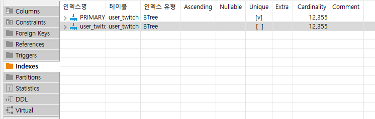

2021.12.21 프로젝트 전체적인 트랜잭션 적용과 인덱스 사용
====================
## 트랜잭션 적용
어노테이션 기반 트랜잭션의 기본적인 설정이 되어있었는데, 실제 프로젝트에는 트랜잭션과 관련된 어노테이션이 적용되어있지 않았던 부분을 깨달았다.     
이 부분에서 트랜잭션은 어떤 상황에서 적용하는것이 맞으며, 해당 프로젝트와 관련해서는 트랜잭션을 어떻게 적용하는 것이 맞는지를 구분하도록 하였다.
````
@Transactional(rollbackFor = Exception.class)
public void userRegister(MemberVO memberVO) throws Exception {
    ...
}
````
대표적으로 회원가입 처리를 할 때에, DB에 회원에 대한 정보와 함께 권한 테이블에도 값을 입력하게 되는데,      
이 경우에 회원 데이터는 입력이 되었는데, 권한 값이 입력이 되지 않으면 회원정보가 정상적으로 작동하지 않기 때문에,      
예외가 발생한 경우에는 회원정보가 아예 저장되지 않도록 @Transactional 어노테이션을 통해서 막도록 하였다.      

이외에도 트랜잭션 처리가 필요한 부분을 찾고있는데, 본 프로젝트의 데이터는 대부분이 트위치 API에서 가져오는 데이터를 실시간으로 프로젝트 내부 DB에 새로고침하여 반영하는 구조이기 때문에,
특별히 한 데이터와 함께 반드시 들어가야 하는 데이터나, 에러 발생시 아예 새로고침 되지 않아야 하는 데이터가 존재하지 않는다고 판단하여, 별도의 트랜잭션 처리는 오히려 성능악화가 될 수 있다고 판단하여 지정하지 않았다.    

이후에도 계속해서 프로젝트를 탐색하여, 트랜잭션이 필요할 것으로 보이는 메소드가 있으면 @Transactional 어노테이션을 통해서 트랜잭션을 걸 예정이다.


## 인덱스의 사용
     
인덱스의 경우에는, 물론 해당 프로젝트는 새로운 데이터를 꾸준히 받아와서 DB에 저장해야하기 때문에 Insert가 굉장히 많은 편이지만,      
그 보다도 일반 사용자에 의해 발생하는 Select가 훨씬 많을 것으로 예상되는 서비스이기 때문에, 인덱싱이 필요할 것으로 보였다.     
이 중에서 대표적으로 인덱스를 적용한 부분은, 트위치 사용자 테이블로, 트위치 사용자 테이블에는 각 데이터별로 고유 Id값도 존재하지만,   
login 칼럼이라고 하는, 트위치 사용자가 로그인시에 사용하는 Id 값이 있다. 이 값은 고유값으로, 카디널리티가 기본키와 같아 인덱스로 적용하기 적당하며, 기본키인 Id값보다도 login을 더 Select에 사용하는 경우가 많아, 인덱스로 지정하였다.     

이외에도 트위치 비디오나 클립의 경우, 특정 사용자의 비디오를 Select하는 경우가 굉장히 많아, 이 값은 카디널리티가 비교적 낮은 값임에도 인덱스를 적용하는게 적절한지 검토중에 있다.     

개인적으로 인턴 중, 그리고 면접을 통해서 부족하다고 생각한 부분을 어느정도 공부 한 후에, 프로젝트에 적용하는게 좋다고 생각되어 공부에 집중하였으나, 막상 공부를 하기 시작하니까 너무 끝이 보이지 않아, 잠시 접고 프로젝트를 정비하는 시간을 갖도록 했다.      
트위치 쇼츠 서비스를 위한 어느정도의 준비는 되었고, 비디오 URL을 통해서 iframe으로 사용자에게 넘기면서 편리하게 볼 수 있는 서비스를 어느정도 구성을 완료하였다.       
우선 다시보기 찜 관리 서비스는 실질적으로 사용할일이 많이 없다는 판단하에 중단하고, 클립 쇼츠 만드는 데에 집중할 예정이다.      
추가로, DB와의 쿼리 속도를 올리기 위해서 여러 작업들을 하고 있는데, 사실 현재 사용에 불편함을 느낄정도로 느리다고 생각되는 부분은 실시간으로 트위치에서 데이터를 가져오는 새로고침 부분인데,       
이 부분의 근본적인 원인은 트위치에서 한 쿼리당 제공하는 데이터를 100개로 제한하고 있기 때문이라서, 개인 프로젝트로써는 어쩔 수 없는 부분 도 있는 것 같다...

## 다음 목표
* 트위치 클립 쇼츠 만들기 (최근 영상 기준, 인기영상 기준, 안본 영상 기준)
