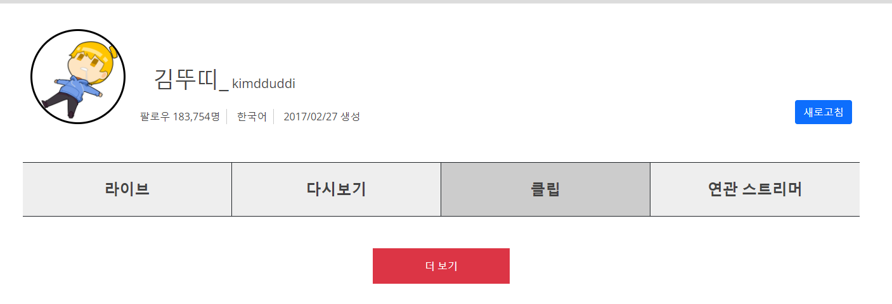
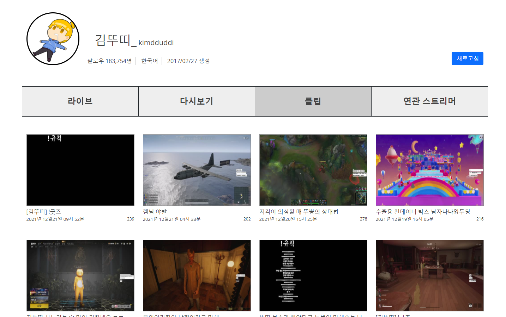
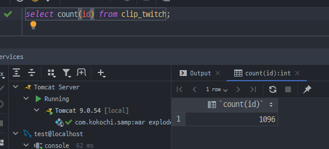
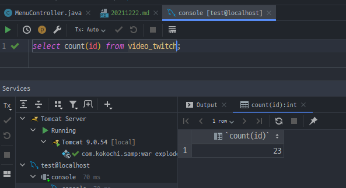
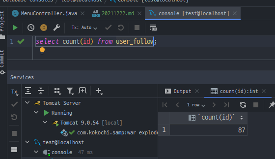

2021.12.22 INSERT와 DELETE를 반복문으로 한번에 처리를 하는것과 따로따로 처리하는것의 차이 분석
====================
## INSERT 문을 반복문으로 넣을때와 하나씩 따로 처리하는 것의 속도차이 계산
        
테스트 DB를 따로 생성하여, 새로고침 기능을 반복문으로 처리하는것과 일반 하나씩 따로 입력하는 것의 차이를 계산해보도록 했다.      
사실 이미 반복문을 적용하면서 해봐야했던 작업이지만, 당시에는 테스트 DB를 만들어서 테스트 해본다는 생각을 미처 못했던 것 같다....     
결과는 생각보다 단순했다.     

      
반복문을 사용하여 INSERT 문 하나로 한 테이블의 모든 데이터를 넣는 경우 - 약 20초     
각 데이터들을 하나하나씩 따로 INSERT문을 넣는 경우 - 약 25초     

사실 약 5초정도의 차이로 물론 어느정도 의미있는 차이이긴 하나, 반복문을 사용함에 따라 얻게되는 리스크도 있기에 고민을 해봐야하는 문제로 보인다.     
Mybatis를 사용한 반복문을 사용하면 무엇보다도, 1000개의 데이터를 INSERT 할 때에, 999개가 완벽해도 1개의 데이터만 문제가 있어도 모든 데이터가 입력이 되지 않는다.      
물론 이 것은 트랜잭션 처리가 되는건 아니지만 어떻게 보면 트랜잭션과 같은 역할을 해 줄수도 있고, 1개의 데이터라도 제대로 들어가지 않으면 새로고침되었다고 할 수 없으므로 맞는거라고 볼 수도 있지만,     
이렇게되면 다시 새로고침할때 똑같은 시간을 또 기다려야하는 문제점도 생긴다.      

다만 근본적으로 사실 오래걸리는 부분은 따로있다.         
     
먼저 김뚜띠 라고 하는 스트리머의 데이터만 가져왔을 때를 예시로 들었다.     
클립 데이터는 총 1096개를 가져온다.      

       
다시보기 데이터는 23개를 가져온다.      

       
팔로우 데이터는 총 87개를 가져온다.     

이 구조에서, 클립은 해당 스트리머의 모든 클립을 싹다 가져오며, 다시보기는 3개월에 한번씩 지워지므로 최근 3개월까지의 데이터만 가져온다.   
즉, 다시보기는 절대적인 개수자체가 적으며, 대부분의 스트리머들이 3개월동안 100개이상의 다시보기를 올리는 경우가 없어, API 통신 한번만에 모든 데이터를 가져올 수 있다.      
이에 비해서 클립데이터는 대부분 매우 많은 수를 갖고있어, 많은 시간이 트위치 API에서 클립 데이터를 가져오는데 시간이 걸린다.      
이 경우에는, 물론 새로고침의 역할을 정상적으로 할 수 있다고 볼 수 없으나, 최근 클립 데이터만 새로고침 하는 방식을 적용하면 시간을 상당히 단축시킬 수 있을 듯 하다.       
완벽하게 새로고침이 되지 않는 이유는, 중간 클립이 문제가 되어서 삭제되는 경우에, 이것이 DB에 반영되지 않기 때문이다.       

팔로우 데이터는 더욱 문제다. 팔로우는 실시간으로 상황이 변화하는 데이터이기 때문에, 무조건 모든값을 조회해야한다.    
위 스트리머와 같은 경우는 팔로우한 스트리머가 87명밖에 되지않아, 많은 조회가 필요없지만, 스트리머에따라 몇백명씩 팔로우를 하는 경우도 있다.    
이런 경우에는 필연적으로 팔로우 데이터를 가져오는데 오랜 시간이 걸릴 수 밖에 없다.      

## 결론
- 반복문을 통해서 INSERT , DELETE를 하는 구조는 일단 유지 (문제가 생기지 않는 한 현상유지 할 것임)
- 클립 데이터는 중간에 비는 데이터가 생기더라도, 일단 최신데이터만 새로고침하도록 함 (실질적인 대부분의 시간이 클립 데이터를 가져오는데 먹기 때문)
- 팔로우 데이터도 일단 유지함 (팔로우 데이터는 모든 데이터를 조사하지 않으면 실질적으로 새로고침의 의미가 없음)

## 다음 목표
* 클립 데이터는 모든 데이터를 조사하는 방식에서, 최근 데이터만 새로고침 하는 방식으로 변경 필요
* 메인 페이지의 관심 스트리머 목록의 데이터를 총 새로고침 하는 기능 만들기
* 트위치 클립 쇼츠 만들기 (최근 영상 기준, 인기영상 기준, 안본 영상 기준)
