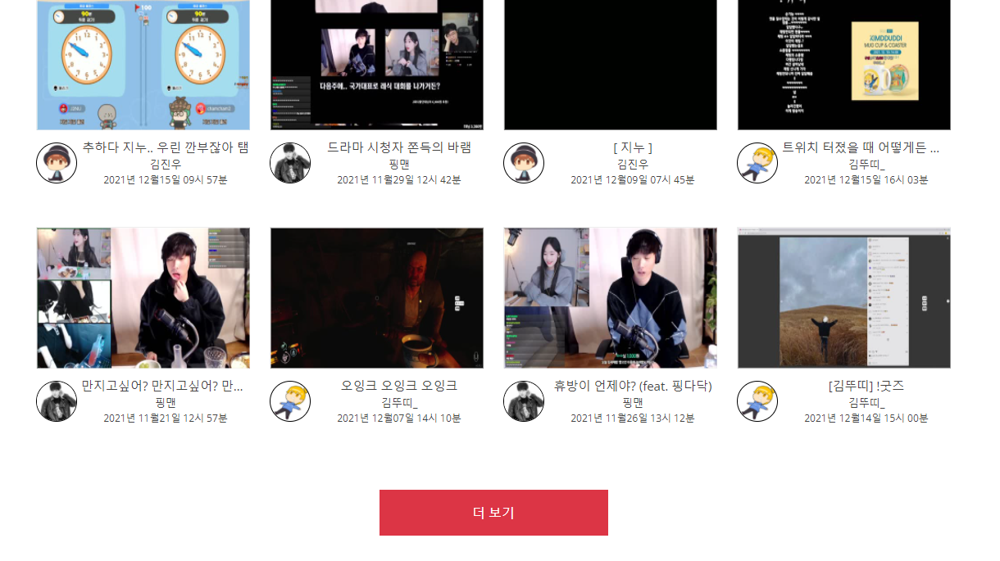
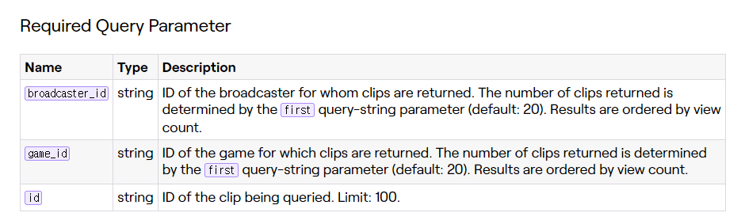

2021.12.24 메인 페이지 관리목록 인기클립 작업 진행
====================
## 메인 페이지 관리목록 인기클립 에러
        
정상적으로 작동하던 관리목록 인기클립 더보기 기능이 최근에 새로고침 기능도 도입하고, 다양하게 쿼리 과정을 변경하는 과정에서 무언가 처리 방식을 건드려서 그런지 제대로 동작하지 않게 되었다.
js파일로 별도의 스크립트 코딩을 하는 동안에, JSP와 연결되는 데이터 부분의 약간의 누락이 있었다.     
해당 하는 부분에 데이터를 추가하였더니 더보기 버튼이 제대로 동작했다.

## 인기클립 새로고침을 최신 데이터만 새로고침하기
      
트위치 API에서 지원해주는 클립 데이터 가져오기 API와 관련된 부분을 확인하였으나, 기본적으로 모든 쿼리가 시청 회수를 기준으로 가져와지기 때문에, 최근 클립 데이터를 가져오기 위해서는 다양한 작업이 필요하다는 부분이 확인되었다.      
그런데 이와 별개로 다른 부분에서 문제가 생길 듯 한데, 이 시청회수와 관련된 부분이다.      
현재 인기클립을 가져오는 데이터의 기준은 시청회수가 기본 기준이 된다. 이에 여러가지 연산이 추가되는 방식이다.    
그런데 이렇게 최신 데이터만 가져오고, 그 이전의 데이터는 가져와서 확인하는 과정을 거치지 않으면, 트위치 서버에서 실시간으로 변화되고있는 시청회수 데이터가 현재 서버로 반영되지 않는다.      
즉, 결국에 이 데이터를 전부 가져와서 DB에 반영하기 위해서는 그냥 클립 데이터를 전부 가져오는게 맞다는 결론을 내렸다.     
그리고 이에 대해서 새로고침을 할 경우에도, 현재 없는 데이터는 삽입하고, 서버에서 사라진 데이터는 또 찾아서 삭제하는 과정을 거치고 있었는데,    
기존에 있는 값을 Update해주는 연산은 해주고있지 않았다. 그래서 이에대한 동작이 오히려 추가될 예정이다.     
이 때문에 기존에 계산했던 속도보다도 더 많은 연산이 들 것으로 예상되나, 결과적으로 정상적인 서비스 제공을 위해서는 어쩔 수 없는 부분으로 보이며, 트위치 API를 개인 프로젝트에서 사용하는 것의 어쩔 수 없는 한계점으로 파악하였다.      

다음 프로젝트 진행에서는 위의 언급한 Update연산을 적용해주는 작업을 진행할 것이다.

## 다음 목표
* 클립 데이터를 모두 가져와서 기존에 있는 값들의 시청회수들을 Update하기
* 메인 페이지의 관심 스트리머 목록의 데이터를 총 새로고침 하는 기능 만들기
* 트위치 클립 쇼츠 만들기 (최근 영상 기준, 인기영상 기준, 안본 영상 기준)
