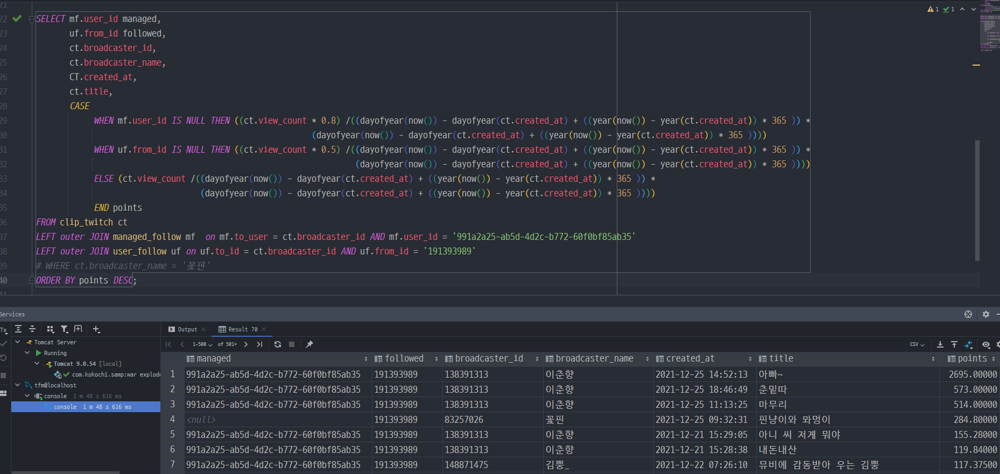

2021.12.26 트위치 클립쇼츠 쿼리문짜기 - 1
====================
## 트위치 클립쇼츠 쿼리문짜기 
트위치 클립쇼츠를 만들 기본적인 틀은 완성하였다.    
우선 데이터를 가져오는것을 테스트 해야하기 때문에, 클립쇼츠를 가져오기 위한 쿼리문을 구성을 하는데, 여기에 많은 어려움이 있을 듯 하다.        
이유는 다음과 같다.    

1. 클립을 가져와 사용자에게 보여주는 우선순위에 대한 계산은 SQL문에서 이루어져야 한다.      
자바단에서 이를 진행하게 되면, 페이징이 불가능해지며, 결국 모든 클립을 가져와서 정렬해야하기 때문에 사실상 클립 쇼츠에서 지향하는 바 와 차이가 있다.      
2. SQL문에서 가져온 클립의 스트리머가 관리목록에 있는 스트리머인지, 현재 사용자에게 팔로우 된 스트리머인지 여부를 파악해야한다.      
우선순위에 차이를 두어야 하기 떄문에, 이에 대한 point값을 별도로 계산해야한다.

이를 적용한 쿼리문이 다음과 같다.       
          
쿼리문 실행 속도는 1분 48초다. Select문이 실행되는데에 상당히 오랜시간이 걸린다.    
우선 원리는 CASE문을 사용하였고, 관리목록과 팔로우목록을 함께 Outer조인하여, 관리목록값이 NULL이면, 한단계 하향된 계산식, 팔로우값이 NULL이면 두단계 하향된 계산식을 반영하는 구조로 되어있다.       
현재 예상되는 부분은 아마도, Outer조인을 하는 과정에서, 관리목록에는 현재 많은 데이터가 없으나, 팔로우 목록을 가져올 때, 매우많은 팔로우 데이터와 매우많은 클립데이터를 서로 조건 조인 하기 때문에 이에 대한 조건조사가 오래걸리는 것으로 보여진다.       
이에 대해서는 인덱스를 적용하는 방식을 변경해보거나, 조건을 적용하는 방식을 아예 바꿔야된다.    
그런데 여러번 고민을 하였는데, 조건을 적용하는 또 다른 방식을 생각하는데에는 많은 시간이 걸릴 듯 하여, 가능하면 현재 CASE문을 사용하는 방식을 진행해야 될 것 같다.       
이에 대해서는 여러가지 부분에서 테스트하고, 가장 효율적인 방법을 선택해야될 것 같다.

## 다음 목표
* 트위치 클립 쇼츠 만들기 (최근 영상 기준, 인기영상 기준, 안본 영상 기준)
