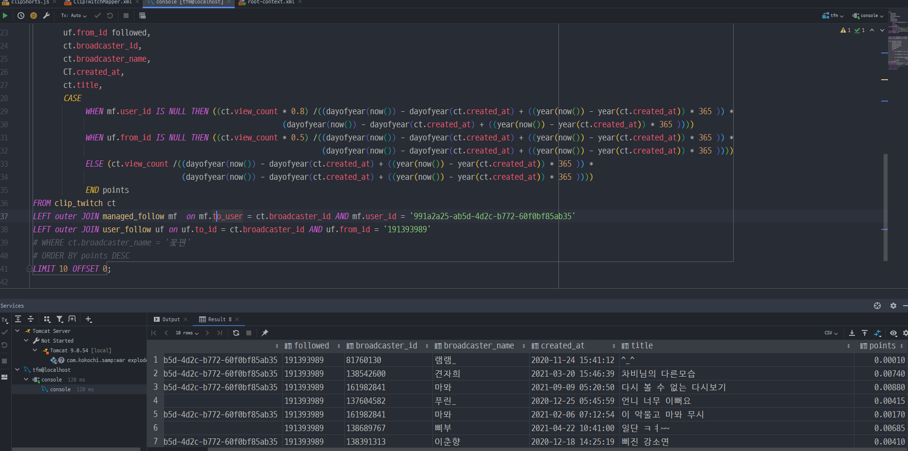

2021.12.27 트위치 클립쇼츠 쿼리문짜기 - 2
====================
## 트위치 클립쇼츠 쿼리문짜기
         
쿼리문을 다양하게 확인 한결과, Join 쿼리문 자체는 크게 문제가 없으나, 연산한 결과값을 기준으로 모든 트위치 클립 데이터를 정렬한다는 과정 자체가 오래걸리는 것으로 보인다.       
즉, 현재 30000개 정도의 클립 데이터 전체를 정렬하는 과정에서 지나치게 많은 시간이 걸리는 것으로 보인다.          
이는 개수를 줄이는 방식으로 진행을 하더라도, 결국 Order By를 쿼리문에서 사용해서 지정된 값을 페이징해서 일부 값만 가져온다는 알고리즘 상, 해소할 방법은 현재 없다고 판단하였다.    
그래서 문제를 쿼리문 수정을 통해서 해결하는 것 보다, 클립 쇼츠의 데이터를 가져오는것을 아예 다른 방식으로 가져오기 위해서 고민을 또 해봐야할 것 같다.     
당장 생각할 수 있는 부분은 트위치 API에서 기본으로 클립은 재생수 순으로 가져오기 때문에, start_date, end_date값을 조절하여, 최근 일주일동안의 데이터만 가져오는 방법이 있을 것이다.     
그런데 이런 방법을 사용하면, 관리목록 데이터를 가져오면 완전히 관리목록의 데이터만 가져오게 되고, 모든 스트리머의 데이터를 가져오면 관리목록의 스트리머에게만 특정하여 가중치를 부여하는 방식이 어려워진다.     
이를 어떻게 방향을 결정할 것인지 향후 방향 설정이 필요하다.    

## 다음 목표
* 트위치 클립 쇼츠 만들기 (최근 영상 기준, 인기영상 기준, 안본 영상 기준)
