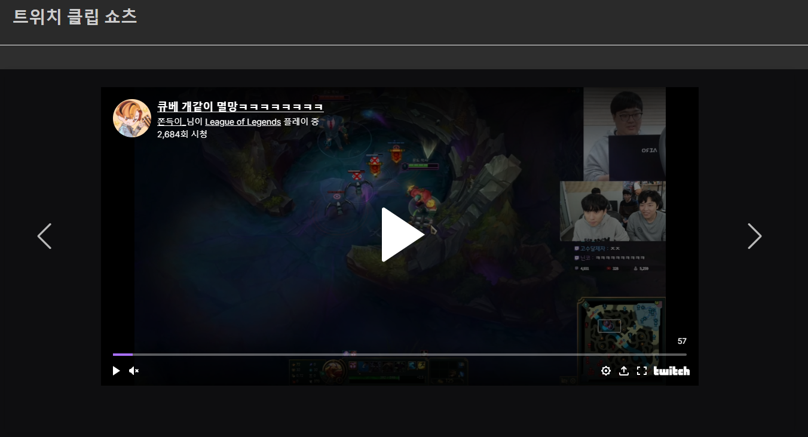

2021.12.31 클라이언트 단에서 클립쇼츠 이동 시, 자동 재생 및 재생 멈춤 기능
====================
## 클립쇼츠 iframe 동작 제어하기
https://dev.twitch.tv/docs/embed/video-and-clips
트위치 embed와 관련된 문서 정보에 의하면 다른 다시보기 영상은 iframe을 스크립트로 제어할 수 있는 기능을 제어하지만, 클립 데이터는 아쉽게도 지원하지 않는다고 한다.    
이 때문에 정상적인 방법으로, 화면을 넘길 때 동영상을 멈추고, 화면에 도착했을 때 재생하도록 제어하는 기능은 불가능하다는 점을 파악했다.     
그래서 대체적인 방법이지만, autoplay 속성이 이미 들어있는 iframe을 화면을 돌릴때 새로 생성하여 보여주는 방법을 택하기로 했다.    
이렇게하면 사용자 편의성은 높아지긴 하나, 슬라이드가 움직일 때 마다 새 iframe이 사용자에게 생성되어 보여줘야하기 때문에 약간의 딜레이가 있다.    
하지만 이 부분을 확인한 결과, 딜레이가 1초가 채 되지 않아서 서비스에 큰 문제가 없는것으로 확인했다.   

      
이제 사용자에서 보여지는 부분의 구현은 어느정도 완성되었다.     
남은 부분은 정렬기준을 세워서 별도의 정렬식을 확보하고, clipShorts_ban 테이블을 구현하여 이미 본 클립 데이터는 가져오지 않도록 하는 작업이 남아있다.    
추가로 지금까지 새로고침 기능이나 여러가지 연산이 지나치게 오래걸렸던 작업들에 클립쇼츠에서 사용한 것 과 같이 쓰레드를 사용하면 상당히 연산시간을 단축시킬 수 있을 것으로 보인다.   
그래서 데이터를 가져오는 부분에도 쓰레드를 넣는 작업을 추가하면 좋을 것으로 보인다.    

## 다음 목표
* 클립쇼츠 데이터 정렬기준 세우기
* 이미 본 영상은 다시 표시되지 않는 clipShorts_ban 테이블을 활용한 구현
* 새로고침 및 데이터 가져올 때 쓰레드를 활용하여 가져오기